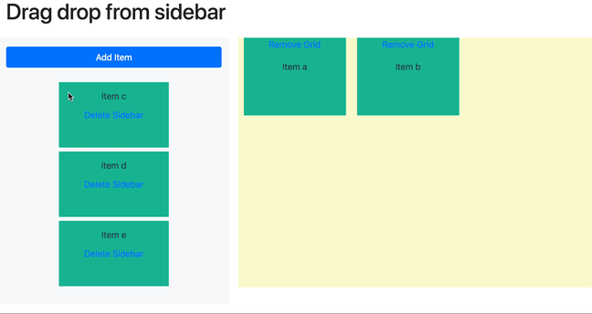
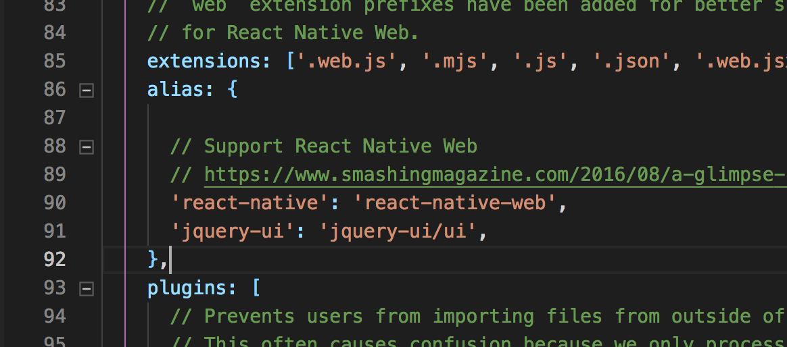

# Drag drop from sidebar

In one of the projects I'm working on I needed to include a drag and drop feature from a sidebar item to grid using React. Of the components found was used React-grid-layout with Toolbox example.
After studying component and applied to the project I realised I needed extra functionality such as drag an item from the sidebar to the grid.

I found the gridstack.js plugin developed in Jquery and although I don’t like to mix react with Jquery I decided to use it for its resources.

In this tutorial I will explain my experience creating a drag and drop prototype where it is drag item from sidebar to grid and remove items from grid or sidebar.



The first step is necessary install the dependencies and set up the webpack.

Dependencies used:

-   gridstack
-   bootstrap
-   jquery
-   jquery-ui

```
npm install gridstack bootstrap jquery jquery-ui
```

After it has got unzip the webpack from react for set up jquery-ui

```
npm run eject
```

Open webpack.config.dev.js file into config folder and you go to line where you find alias and you add the follow instruct:

```
'jquery-ui': 'jquery-ui/ui'
```



Now, let's start writing the code with the importation of the dependencias:

```javascript
import ReactDOMServer from "react-dom/server";
import "bootstrap/dist/css/bootstrap.css";
import $ from "jquery";
import "gridstack/dist/gridstack";
import "gridstack/dist/gridstack.jQueryUI";
import "gridstack/dist/gridstack.css";
import "gridstack/dist/gridstack-extra.css";
import "./grid.css";
```

It's necessary to use ReactDOMServer because one of the problems of the gridstack is that use jquery, so we need to convert a component React to Jquery.

In the constructor of class let's add a pre-list of grid items and sidebar items.

```javascript
constructor() {
  super();

  const itemsGrid = [
    { id: "a", name: "Item a", x: 0, y: 0, width: 2, height: 2 },
    { id: "b", name: "Item b", x: 2, y: 0, width: 2, height: 2 }
  ];

  const itemsSidebar = [
    { id: "c", name: "Item c" },
    { id: "d", name: "Item d" },
    { id: "e", name: "Item e" }
  ];

  this.state = {
    itemsGrid,
    itemsSidebar
  };
}
```

The id is identification of item from grid and sidebar, the name is um value it will be showing. In itemsGrid variable it have x and y variables it are position on grid and width and height variables it are dimensions.

The layout build must contain sidebar and grid and both need of the ref for use in Jquery.

```html
<div className="container-fluid">
    <h1 className="mb-4">Drag drop from sidebar</h1>

    <div className="row">
        <div className="col-md-3 bg-light pt-3">
            <button
                type="button"
                className="btn btn-primary btn-block"
                onClick="{this.onAddSidebar.bind(this)}"
            >
                Add Item
            </button>

            <div className="sidebar" ref={sidebar => (this.sidebar = sidebar)}
            />
        </div>

        <div className="col-md-9">
            <div className="grid-stack grid-stack-12" ref={grid => (this.grid =
            grid)} />
        </div>
    </div>
</div>
```

It's necessary create a component for items of the grid and sidebar

```javascript
class ItemGrid extends Component {
    render() {
        return (
            <div id={this.props.item.id} className="grid-stack-item">
                <div className="grid-stack-item-content">
                    <p>
                        <a
                            href="javascript:void(0);"
                            className="removeItemGrid"
                        >
                            Remove Grid
                        </a>
                    </p>
                    <p>{this.props.item.name}</p>
                    <p>
                        <a
                            href="javascript:void(0);"
                            className="deleteItemSidebar"
                        >
                            Delete Sidebar
                        </a>
                    </p>
                </div>
            </div>
        );
    }
}
```

For finishing all layout it is necessary to create the css file.

```css
.grid-stack {
    background: lightgoldenrodyellow;
}

.grid-stack-item-content {
    color: #2c3e50;
    text-align: center;
    background-color: #18bc9c;
}

.sidebar {
    padding: 25px 0;
    text-align: center;
}

.sidebar .grid-stack-item {
    width: 200px;
    height: 100px;
    text-align: center;
    line-height: 100px;
    z-index: 10;
    background: rgba(0, 255, 0, 0.1);
    cursor: default;
    display: inline-block;
    margin-bottom: 5px;
}

.sidebar .grid-stack-item .grid-stack-item-content {
    background: none;
}

.sidebar .grid-stack-item .grid-stack-item-content {
    height: 100%;
    background: none;
}

.sidebar .grid-stack-item .grid-stack-item-content > p {
    line-height: normal;
}

.sidebar .grid-stack-item .grid-stack-item-content .removeItemGrid,
.grid-stack .grid-stack-item .grid-stack-item-content .deleteItemSidebar {
    display: none;
}
```

The .removeItemGrid show the remove link when the item is on grid and .deleteItemSidebar show the delete link when item is on sidebar, both are different actions.

The implemantation start with componentDidMount method:

```javascript
componentDidMount() {
    // Load element grid
    this.$gridReact = $(this.gridReact);
    // Load element sidebar
    this.$sidebarReact = $(this.sidebarReact);

    // Definition of the grid options
    const options = {
        width: 12,
        height: 6,
        acceptWidgets: true,
        float: true
    };

    // Set option in gridstack
    this.$gridReact.gridstack(options);

    // Load grid items
    this.loadGrid();
    // Load sidebar items
    this.loadSidebar();

    this.$gridReact.on("change", this.onChange.bind(this));
    this.$gridReact.on("added", this.onAdded.bind(this));

    this.$gridReact.on(
        "click",
        ".removeItemGrid",
        this.onRemoveItemGrid.bind(this)
    );
    this.$sidebarReact.on(
        "click",
        ".deleteItemSidebar",
        this.onDeleteItemSidebar.bind(this)
    );
}
```

The this.$gridReact and this.$sidebarReact are used to get the reference of the element DOM.
The options variable are the grid parameters.

-   width: amount of columns;
-   height: maximum rows amount;
-   acceptWidgets" accept widgets dragged from other grids or from outside;
-   float: enable floating widgets;

For more information, access [doc](https://github.com/gridstack/gridstack.js/tree/develop/doc#options)

Next line are setting up the parameters in grid.

The this.loadGrid() and this.loadSidebar() call the methods to load the items.

After, it is attaches event handlers for grid, the gridstack has some events, you can access [doc](https://github.com/gridstack/gridstack.js/tree/develop/doc#events) to know all events.

For this tutorial is used change and added events. The Change is used to adding/removing items or existing items change their position/size. And the added is used to add item from sidebar to grid.

After, it has click event with .removeItemGrid class selector that it is only executed when clicked in a class that have .removeItemGrid class. in other words when clicked in .removeItemGrid link will be remove item from grid.
The same occur with .deleteItemSidebar click sidebar, but it delete from sidebar.

The next componentWillUnmount method used to cleaning up of DOM elements.

```javascript
componentWillUnmount() {
    $(this.gridReact).on("change", this.onChange.bind(this));
    $(this.gridReact).on("added", this.onAddGridFromSidebar.bind(this));
    $(this.gridReact).on(
        "click",
        ".removeItemGrid",
        this.onRemoveItemGrid.bind(this)
    );
    $(this.$sidebarReact).on(
        "click",
        ".deleteItemSidebar",
        this.onDeleteItemSidebar.bind(this)
    );
}
```

For load the items on grid is used the follow code:

```javascript
loadGrid() {
    const grid = this.$gridReact.data("gridstack");
    const items = this.state.itemsGrid;
    items.forEach(item => {
        grid.addWidget(
            ReactDOMServer.renderToStaticMarkup(
                <ItemGrid item={item} />
            ),
            item.x,
            item.y,
            item.width,
            item.height,
            false
        );
    }, grid);
}
```

The addWidget is used to create new item. The addWidget has eight parameters, you can [see](https://github.com/gridstack/gridstack.js/tree/develop/doc#addwidgetel-x-y-width-height-autoposition-minwidth-maxwidth-minheight-maxheight-id). But it will be only 6 parameters:

-   el - item html
-   x, y, width, height - widget position/dimensions (optional)
-   autoPosition - if true then x, y parameters will be ignored and widget will be places on the first available position (optional)

The parameter first I'm using ReactDOMServer.renderToStaticMarkup to receives JSX from component and returns clean and escaped html in string, because the render is make for jQuery.

for load the items in sidebar, it is used the method:

```javascript
loadSidebar() {
    // Load state
    const itemsSidebar = this.state.itemsSidebar;
    const items = itemsSidebar.map(item => {
        return ReactDOMServer.renderToStaticMarkup(
            <ItemGrid item={item} />
        );
    });
    // Remove all children of the sidebar
    this.$sidebarReact.children().remove();
    // Load new elements sidebar
    this.$sidebarReact.prepend(items);
    // Re-load sidebar functionalities
    this.dragSidebar();
}
```

That method just data load from state to jQuery function and it is used the same process of render (ReactDOMServer.renderToStaticMarkup). After, it is delete all item and added again. It is call the method this.dragSidebar that enable draggable functionality from sidebar to grid.

The this.draggable has follow code:

```javascript
dragSidebar() {
    this.$sidebarReact.children().draggable({
        revert: "invalid",
        handle: ".grid-stack-item-content",
        scroll: false,
        appendTo: "body"
    });
}
```

The dragSidebar method has functanality of sidebar drag and drop. it is used this.\$sidebarReact.children() because it is necessary all items from sidebar has the drag and drop. The parameters are used to:

-   revert: for item return to sidebar if the item has not been dropped on a droppable.
-   handle: specific the element for the dragging
-   scroll: container auto-scrolls while dragging.
-   appendTo: where the draggable helper should be appended to while dragging.

Now, It will be implemented the events

```javascript
onAddGridFromSidebar(e, items) {
    const id = items[0].el[0].id;
    const itemsSidebar = this.state.itemsSidebar;

    const index = itemsSidebar.map(item => item.id).indexOf(id);
    const itemGrid = itemsSidebar[index];
    itemsSidebar.splice(index, 1);

    this.setState(prevState => ({
        itemsSidebar,
        itemsGrid: [...prevState.itemsGrid, itemGrid]
    }));
}
```

The onAddGridFromSidebar method remove the item from sidebar, itemsSidebar state, and add in the itemsGrid state.

```javascript
onChange(e, items) {
    if (items === undefined) {
        return false;
    }
    let id, itemsGrid, index;
    items.forEach(item => {
        id = item.id === undefined ? item.el[0].id : item.id;

        itemsGrid = this.state.itemsGrid;

        index = itemsGrid.map(item => item.id).indexOf(id);
        itemsGrid[index].x = item.x;
        itemsGrid[index].y = item.y;
        itemsGrid[index].width = item.width;
        itemsGrid[index].height = item.height;

        this.setState({ itemsGrid });
    });
}
```

This method onChange catch up the all modification in the items changed. It is necessaring to use forEach for save the colisions change.

The two last methods from events are onRemoveItemGrid and onDeleteItemSidebar.

The onRemoveItemGrid remove the item from grid and add in state of the sidebar. In the end of method is executed the loadSidebar() to re-load the drag and drop events of the jQuery

```javascript
onRemoveItemGrid(e) {
    const id = e.target.parentElement.parentElement.parentElement.id;

    // Remove item from grid by dom
    const el = document.getElementById(id);
    this.$gridReact.data("gridstack").removeWidget(el);

    // Remove item from state
    const itemsGrid = this.state.itemsGrid;
    const index = itemsGrid.map(item => item.id).indexOf(id);
    const itemsSidebar = itemsGrid[index];
    itemsGrid.splice(index, 1);

    this.setState(prevState => ({
        itemsSidebar: [...prevState.itemsSidebar, itemsSidebar],
        itemsGrid
    }));

    this.loadSidebar();
}
```

The onDeleteItemSidebar method just remove the item from sidebar.

```javascript
onDeleteItemSidebar(e) {
    const id = e.target.parentElement.parentElement.parentElement.id;
    const itemsSidebar = this.state.itemsSidebar;

    const index = itemsSidebar.map(item => item.id).indexOf(id);
    itemsSidebar.splice(index, 1);

    this.setState({ itemsSidebar });
}
```

This tutorial show the basic of the drag and drop with sidebar using react. Unhappy it is necessary use jQuery.

I hope have to helped you.

Thanks
